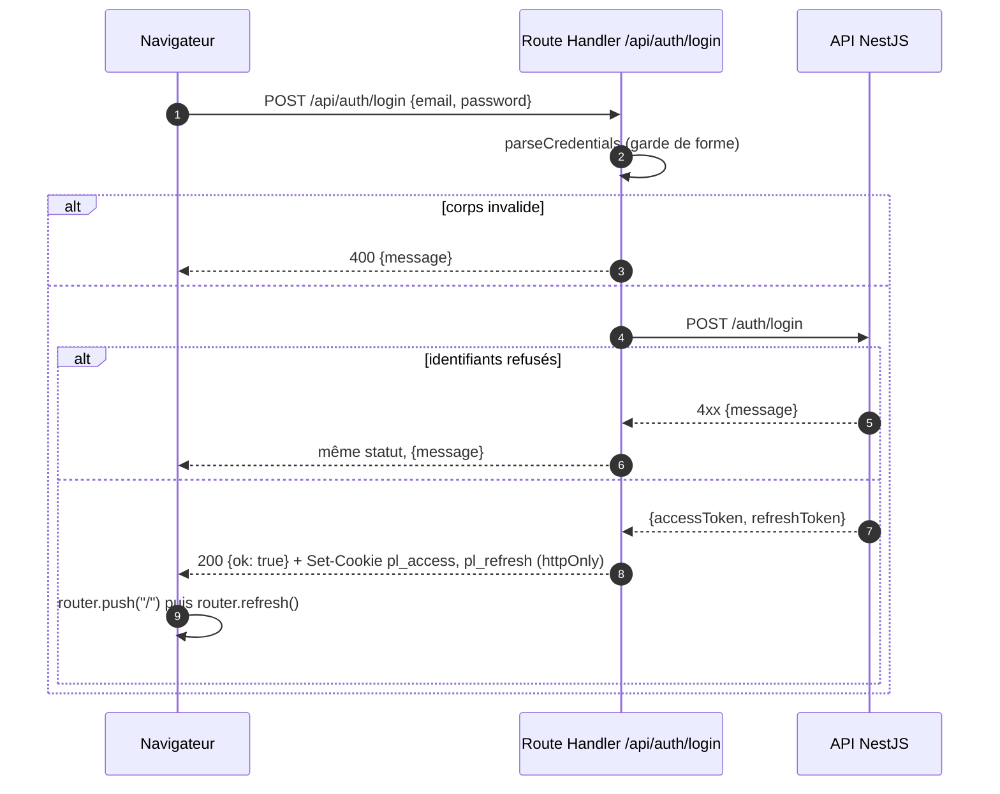
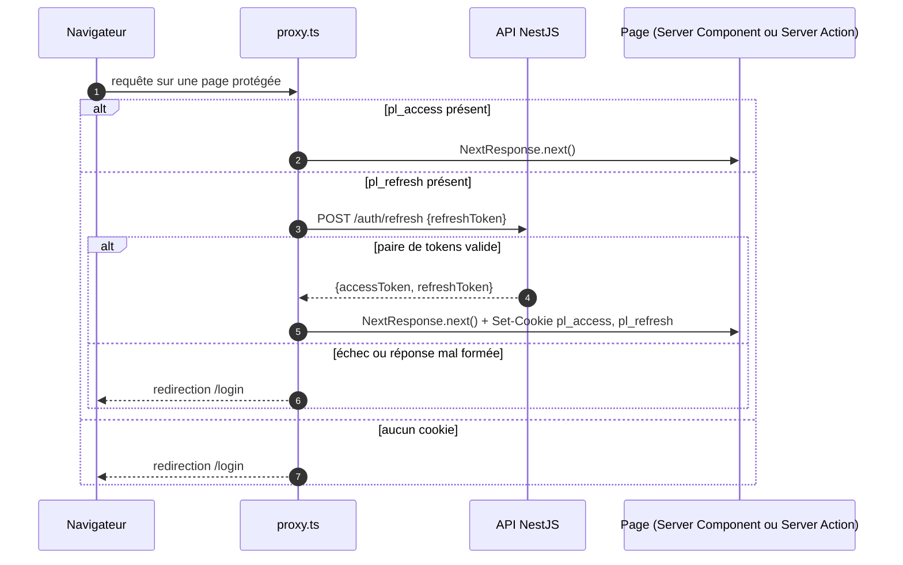
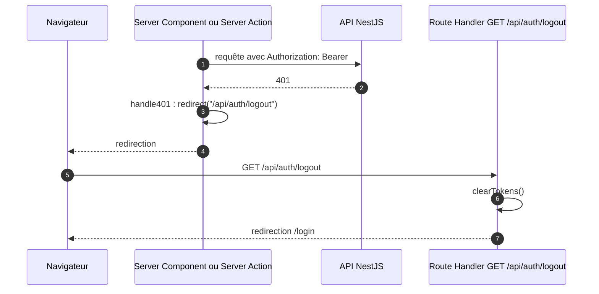

# Authentification

Deux cookies httpOnly, `pl_access` (15 min) et `pl_refresh` (7 j), posés uniquement par le code serveur du front (`src/lib/cookies.ts:3-17`). Le navigateur ne voit jamais les tokens. Décision : [ADR 0001](adr/0001-cookies-httponly.md).

Les durées des cookies doivent suivre `JWT_ACCESS_EXPIRES_IN` et `JWT_REFRESH_EXPIRES_IN` côté API : le proxy ne lit jamais l'`exp` du JWT et tient la présence du cookie pour une preuve de validité (`src/lib/cookies.ts:6-9`).

## Login

Même séquence pour `/api/auth/register`, avec un mot de passe d'au moins 8 caractères (`src/app/api/auth/register/route.ts:7`).

Sources : `src/app/(auth)/login/login-form.tsx:14-31`, `src/app/api/auth/login/route.ts:5-15`, `src/lib/credentials.ts:10-28`, `src/lib/auth.ts:25-49`.

Le matcher du proxy exclut `/api` : les Route Handlers d'auth ne passent pas par lui (`src/proxy.ts:70-73`).

## Refresh transparent dans `src/proxy.ts`

Le refresh vit dans le proxy parce qu'un Server Component ne peut pas poser de cookie pendant le rendu (`src/proxy.ts:13-21`).

Sources : `src/proxy.ts:22-46` pour l'aiguillage, `src/proxy.ts:48-68` pour `tryRefresh`. La réponse est validée avant de poser les cookies (`src/proxy.ts:60-63`). Sur une page publique (`/login`, `/register`, `src/proxy.ts:11`), un utilisateur déjà connecté ou rafraîchi est redirigé vers `/`, sinon la page s'affiche (`src/proxy.ts:28-44`).

Le proxy fait un appel réseau à chaque expiration de l'access, soit environ toutes les 15 min ; décoder l'`exp` localement est noté comme optimisation possible (`src/proxy.ts:19-20`).

## 401 hors proxy

Le proxy ne voit que la présence du cookie. Un access non expiré peut être rejeté par l'API (clé JWT tournée, compte supprimé) : le middleware `handle401` de `serverApi` le rattrape (`src/lib/api.ts:11-21`).

Sources : `src/lib/api.ts:14-21`, `src/app/api/auth/logout/route.ts:9-13`, `src/lib/auth.ts:51-55`. La déconnexion volontaire passe par `POST /api/auth/logout` (`src/app/(app)/logout-button.tsx:10-14`, `src/app/api/auth/logout/route.ts:4-7`).

## Identité côté serveur

`getCurrentUser()` décode le payload du JWT sans vérifier la signature, ce qui n'est sûr que parce que seul le code serveur du front pose le cookie (`src/lib/auth.ts:63-79`). Le rôle sert à masquer les actions réservées à `ADMIN` (`src/app/(app)/meals/page.tsx:22-23`, `src/app/(app)/meals/page.tsx:57`).
