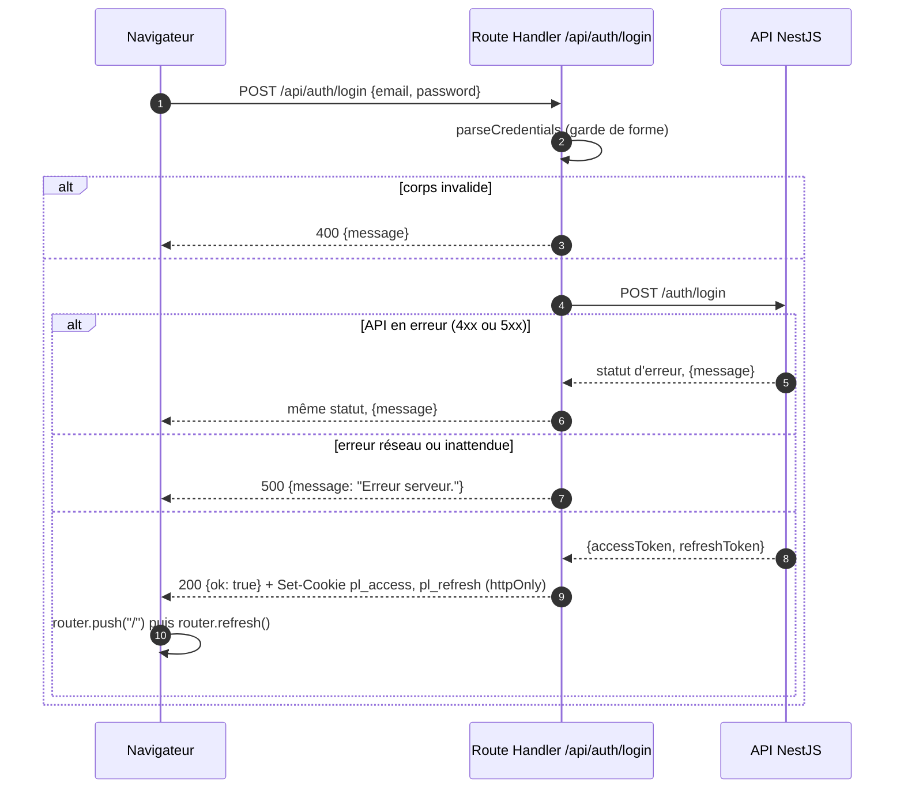
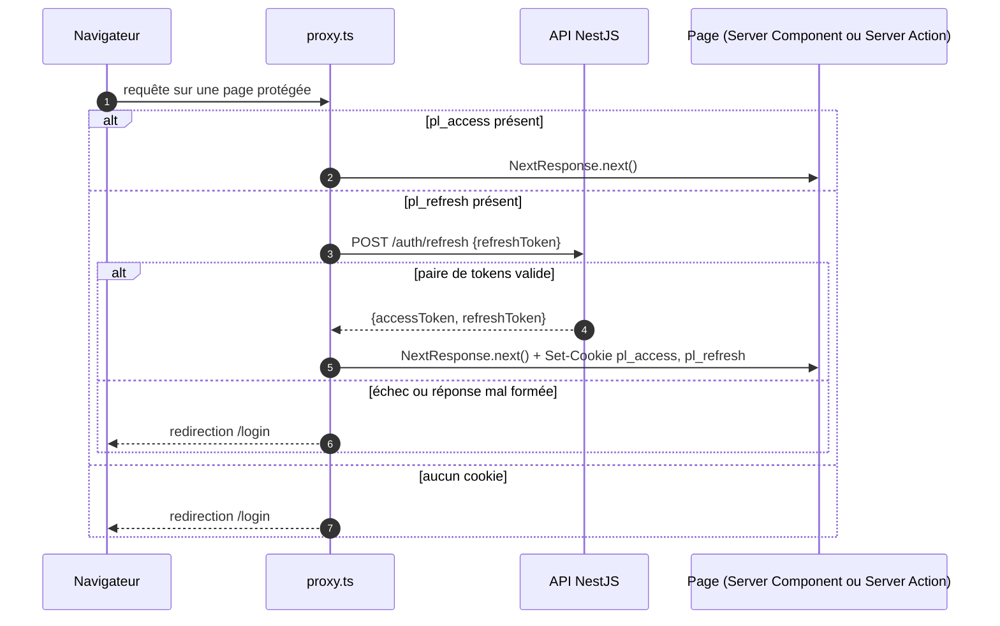
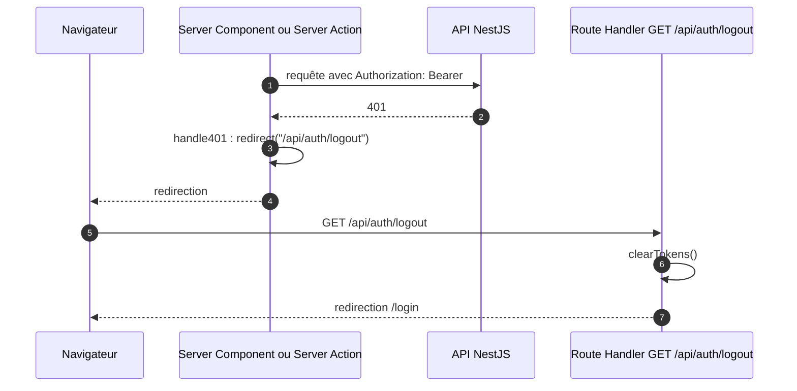

# Authentification

Deux cookies httpOnly, `pl_access` (15 min) et `pl_refresh` (7 j), posés par le code serveur du front (`src/lib/cookies.ts`). Le JavaScript du navigateur ne lit jamais les tokens. Décision : [ADR 0001](adr/0001-cookies-httponly.md).

`ACCESS_MAX_AGE` et `REFRESH_MAX_AGE` doivent suivre `JWT_ACCESS_EXPIRES_IN` et `JWT_REFRESH_EXPIRES_IN` côté API : le proxy ne lit jamais l'`exp` du JWT et tient la présence du cookie pour une preuve de validité.

## Login

Même séquence pour `/api/auth/register`, avec un mot de passe d'au moins 8 caractères (`parseCredentials(…, 8)` dans `src/app/api/auth/register/route.ts`).

Sources : `LoginForm` (`src/app/(auth)/login/login-form.tsx`), `POST` (`src/app/api/auth/login/route.ts`), `parseCredentials` (`src/lib/credentials.ts`), `postAuth` et `setTokens` (`src/lib/auth.ts`). `postAuth` lève une `ApiError` qui porte le statut de l'API, quel qu'il soit ; toute autre exception, dont une erreur réseau, tombe dans le 500.

Le matcher du proxy exclut `/api` : les Route Handlers d'auth ne passent pas par lui (`config.matcher`, `src/proxy.ts`).

## Refresh transparent dans `src/proxy.ts`

Le refresh vit dans le proxy parce qu'un Server Component ne peut pas poser de cookie pendant le rendu.

Sources : `proxy` pour l'aiguillage, `tryRefresh` pour l'appel et la validation de la paire avant pose des cookies (`src/proxy.ts`). Sur une page publique (`PUBLIC_PATHS` : `/login`, `/register`), un utilisateur déjà connecté ou rafraîchi est redirigé vers `/`, sinon la page s'affiche.

Le proxy fait un appel réseau à chaque expiration de l'access, soit environ toutes les 15 min ; le commentaire `ponytail:` de `proxy` note qu'on peut décoder l'`exp` localement si la latence gêne.

Limites connues, laissées en l'état ([#26](https://github.com/KylianGERMAIN/prepalist_front/issues/26), fermée NOT_PLANNED) :

- `tryRefresh` avale toute erreur, réseau compris : une API endormie déconnecte une session valide.
- Aucun timeout sur les `fetch` serveur (`serverApi`, `postAuth`, `tryRefresh`) ; seul `fetchApiVersion` du footer en pose un.
- `handle401` réagit à tout 401, quelle qu'en soit la cause.
- Ces limites restent sans effet tant que le moniteur d'uptime externe pingue `/health` et empêche l'instance Render de s'endormir.

## 401 hors proxy

Le proxy ne voit que la présence du cookie. Un access non expiré peut être rejeté par l'API (clé JWT tournée, compte supprimé) : le middleware `handle401` de `serverApi` le rattrape (`src/lib/api.ts`).

Sources : `handle401` (`src/lib/api.ts`), `GET` (`src/app/api/auth/logout/route.ts`), `clearTokens` (`src/lib/auth.ts`). La déconnexion volontaire passe par `POST /api/auth/logout`, appelé par `LogoutButton`.

## Identité côté serveur

`getCurrentUser()` (`src/lib/auth.ts`) décode le payload du JWT sans vérifier la signature. `httpOnly` n'empêche pas un utilisateur de forger son propre cookie : la garantie vient de l'API, qui vérifie la signature à chaque appel. Le rôle décodé ne sert qu'à l'affichage, par exemple masquer les actions réservées à `ADMIN` dans `MealsPage`. Ne jamais autoriser une action sur ce rôle.
